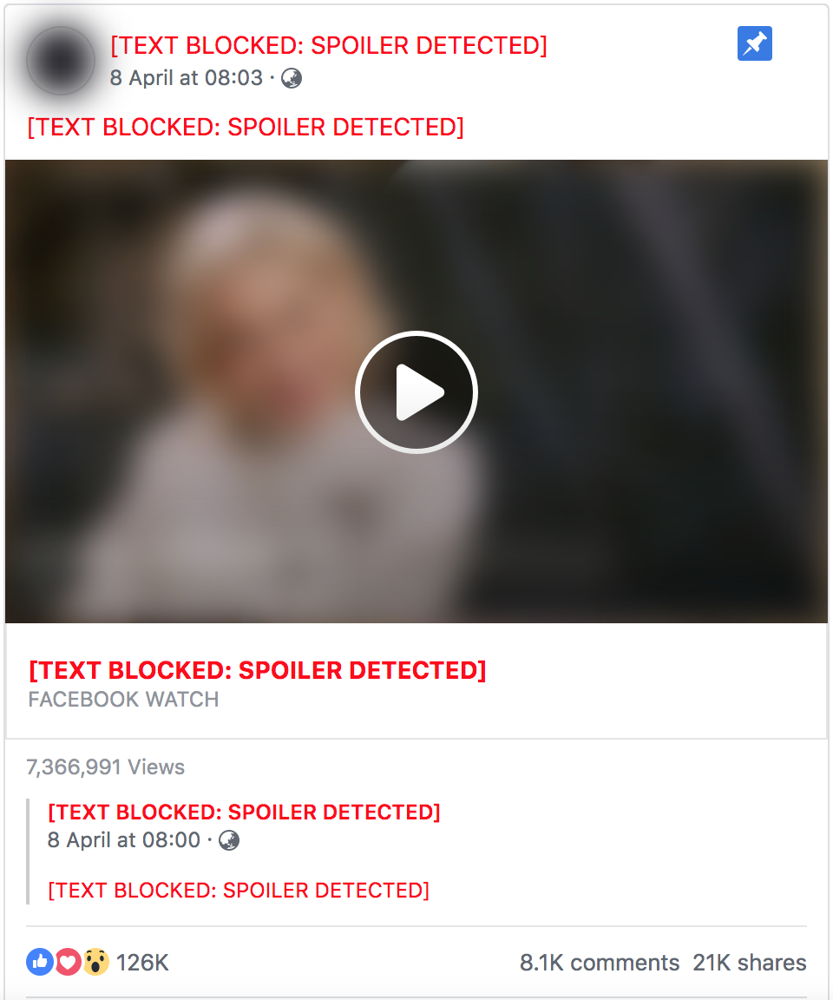

 
# :sparkles: GoT: Hide That Spoiler - Chrome Extension 

This extension will save you from reading any Game Of Thrones Spoilers as well as visual images.  

This extension is developed by **Rachit**, a Software Engineer who is making world a better place by uploading videos on YouTube about his career choices, cool web projects, programming, data structures, algorithms, and more!   

> ## Never Under Estimate the power of a Frustrated Software Developer

I am not an expert with Google Chrome Development and this is my first extension made ever. 

 

# Features
- **Spoiler Blocking**: Searches entire web page and replaces Spoilers with text `##[TEXT BLOCKED: SPOILER DETECTED]`
- **Image Blurring**: Blurs the neighbouring Images which are relevant and might reveal the Spoiler information.
- **Simple, BugLess and Easy**: If there's a bug, it's a feature.
- **Open Source**: On serious note, if there's an issue, please log it and also raise a PR if you can fix it.
- **Customizable**: As you have the source code, you can customize it as per your needs ;) 

# How To Use?
- Clone this repository or download as a zip file
- Incase you downloaded as a zip, unzip it
- Open Google Chrome
- Go to `chrome://extensions`
- Click on `Load Unpacked` which you can see in the top left side.
- Select the path where you cloned/downloaded this project.
- An icon  should appear besides your Chrome Search bar.
- That's all :D Try opening any [Game of Thrones Spoiler](https://www.google.com/search?ei=ubSxXMO5HY7Y0wKQ8J-ICQ&q=game+of+thrones+spoilers+list&oq=game+of+thrones+spoilers+list&gs_l=psy-ab.3...1044.1447..1643...0.0..0.175.802.0j5......0....1..gws-wiz.dqbPZYkKiHY) page to enjoy the blocking power.

# Why this Chrome Extension exists?
When I created this extension, its purpose was: 
- An attempt to save myself from GoT (Game of Thrones) spoilers 
- To solve the problem of spoilers as a Software Developer
- To learn how to creat kick-ass Chrome Extensions

# Can I contribute?
Ofcourse! I will be shocked to see a notification saying `User {xyz} created a Pull Request.`  
I promise to approve the PR first, and only then review it.
